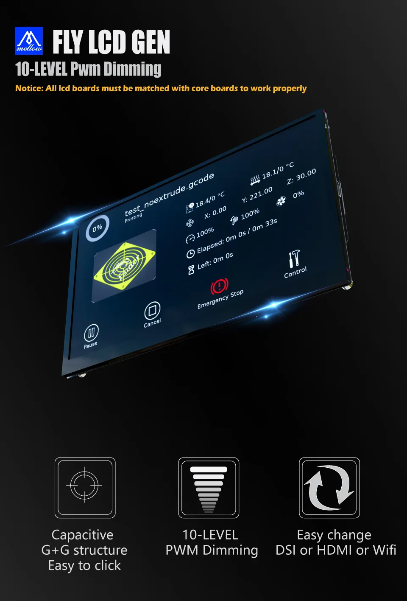

## Overview

The Mellow Fly LCD screens come in three size varieties: 4.3-inch, 5-inch and 7-inch. Specifics on these panels can be found on the [Mellow Fly LCD panel](./fly_lcd_panel.md) documentation page.

The Mellow Fly LCD screens don't work independently on their own. They require one of three "Core" boards to function, which add the required I/O to the back side of the LCD panel. You can check those out on the [Mellow Fly LCD Core](./fly_lcd_core.md) page.

## Features

1. Split design: one screen backplane (panel) can be used with multiple core boards (DSI, HDMI, Wireless), saving money for users
2. Various sizes available: 4.3", 5", 7"
3. HD resolution
4. 10 levels of brightness adjustment (PWM)
5. (Up to) 180° screen rotation, to allow for any orientation 
6. Power-off memory: brightness and other settings do not need to be reset every time you turn on the computer

