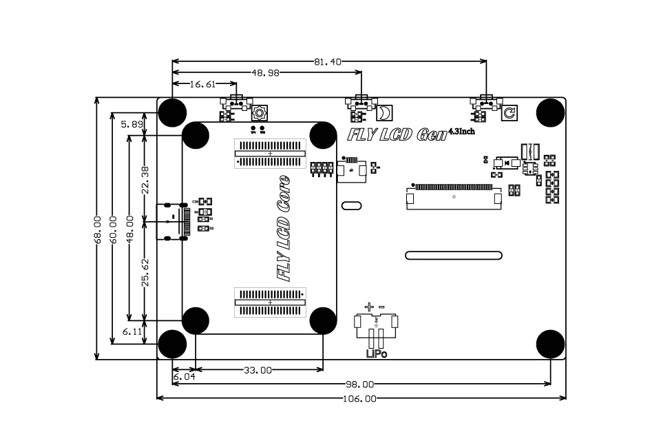
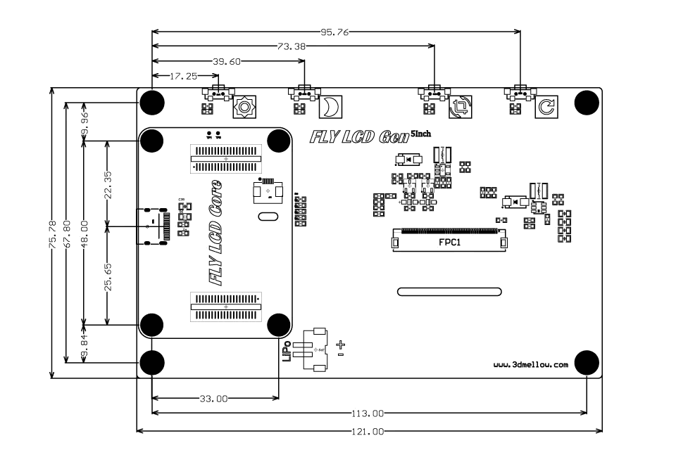
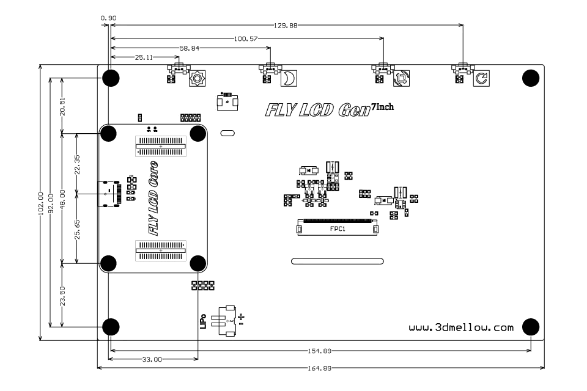

## Dimensions

Viewed and measured from the rear (PCB) side

### 4.3 Inch

Board

Edge to edge

- Width: 106 mm
- Height: 68 mm

Mounting holes

Center to center

- Width: 98 mm apart
- Height: 60 mm apart

Buttons / Connections

Distance from top-left mounting hole

- Settings: 16.61 mm
- Sleep: 48.98 mm
- Reset: 81.4 mm
- Core board: 
    - Top: 5.89 mm
    - Bottom: 6.11 mm
    - Left: 6.04
    Between centers of mounting holes

### 5 Inch

### 7 Inch

